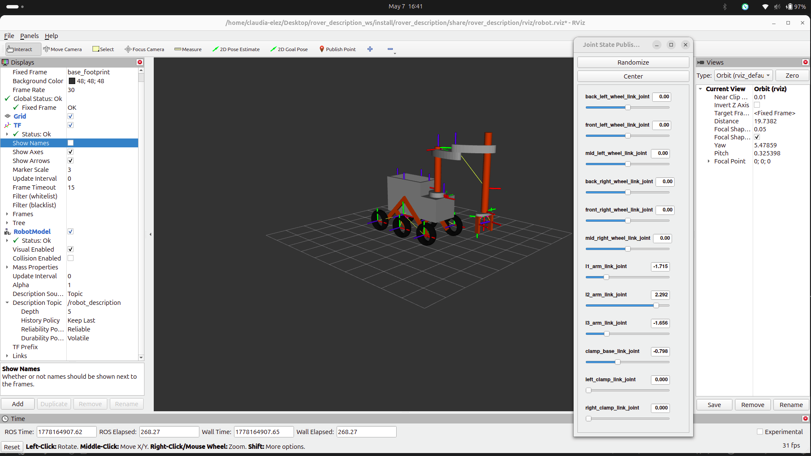
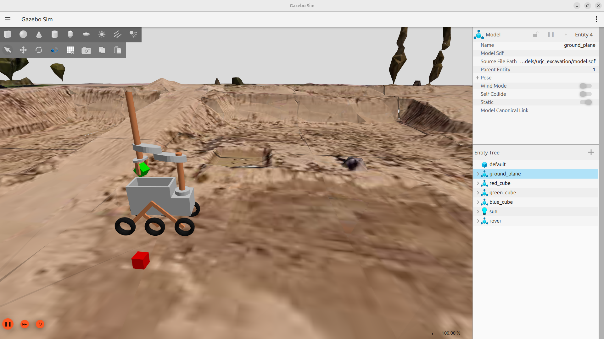
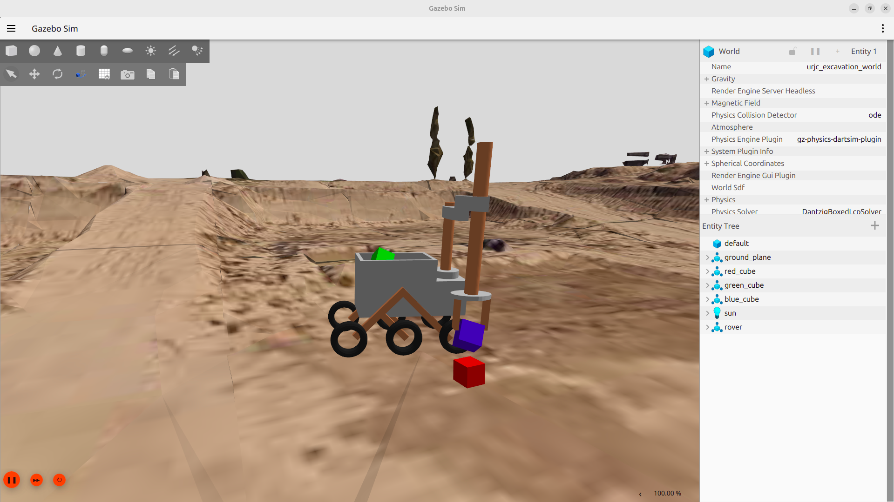
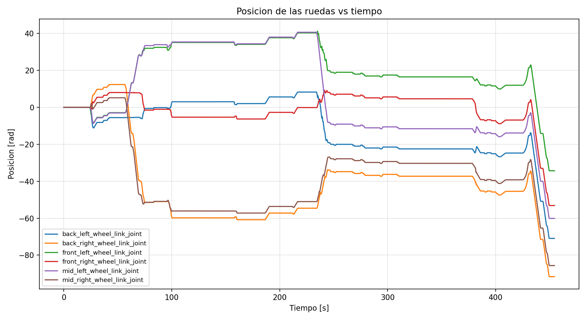
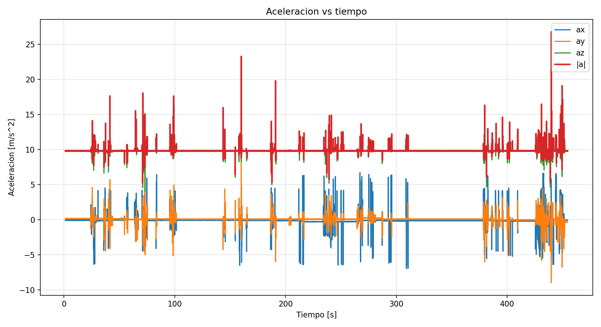
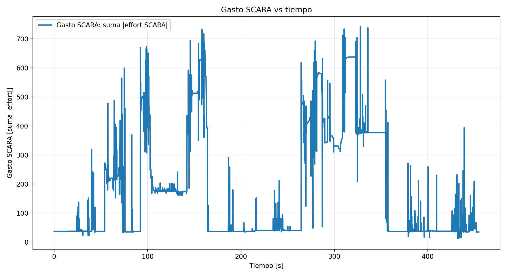

# Práctica 3: Simulación de Robots usando middleware

- **Autor:** Claudia Élez Mencía
- **Asignatura:** Modelado y Simulación de Robots

# Introducción
Esta práctica consiste en teleoperar un rover, diseñado en prácticas anteriores, utilizando ROS y MoveIt. Para ello, esta práctica se ha dividido en 2 partes:
- **Parte A:** Introducción a xacro y compatibilidad con los estándares REP-103 y REP-105
- **Parte B:** Configuración de MoveIt, secuencia de acciones y análisis de costes.

# Parte A
El modelo final, incluyendo los sensores (cámaras e IMU) se encuentra en el paquete [rover_description](./src/rover_description).
Tras esta parte, se ha conseguido visualizar el rover en Rviz y controlarlo mediante la gui (joint_state_publisher_gui).


Para poder visualizar el rover en Rviz, se debe lanzar el siguiente launcher:
```bash
ros2 launch rover_description robot_joint_gui.launch.py
```

La estructura final de TFs se encuentra en [model_tfs](frames_2026-05-08_20.07.36.pdf).

# Parte B
Esta parte consiste en la ejecución de las siguientes acciones:
1. Recoger el cubo verde y meterlo en el compartimento del rover.
2. Recoger el cubo azul y colocarlo encima del rojo
3. Avanzar 10 metros en línea recta

## Configuración y ejecución de las acciones

Para esta parte, el SCARA se ha configurado con el MoveIt Assistant, esta configuración se encuentra en el paquete [rover_moveit_config](./src/rover_moveit_config/) y las ruedas del rover se teleoperan mediante el nodo 'teleop_twist_keyboard'.

Para la teleoperación, lanzamos los siguientes comandos (cada uno en una terminal):
```bash
ros2 launch rover_description robot_gazebo.launch.py world_name:=urjc_excavation_msr
ros2 launch rover_moveit_config move_group.launch.py
ros2 launch rover_description robot_controller.launch.py
ros2 run teleop_twist_keyboard teleop_twist_keyboard
```

Para grabar las rosbag:
```bash
ros2 bag record /cmd_vel /imu /joint_states -o practicafinal
```
## Imágenes de la ejecución

### Captura 1: Agarrando el cubo verde

### Captura 2: A punto de colocar el cubo azul sobre el rojo


Se pueden observar más imágenes de la ejecución en la carpeta [docs](./docs).

## Análisis de los datos recogidos

A lo largo de la ejecución, se ha grabado una rosbag que contiene los topics '/imu', '/joint_states', '/cmd_vel' para poder analizar el coste a lo largo de las acciones.

- Enlace de descarga de la rosbag: [practicafinal](https://urjc-my.sharepoint.com/:f:/r/personal/c_elez_2023_alumnos_urjc_es/Documents/rosbag_practica_final_msr?csf=1&web=1&e=Fc2KvS)

Además, gracias al script [rosbag_analysis.py](./rosbag_analysis.py) hemos obtenido las siguientes gráficas:

### Posición de las ruedas vs Tiempo


Esta gráfica representa la evolución angular de las seis ruedas del rover durante toda la ejecución de la práctica, utilizando la información obtenida desde el topic /joint_states.

Durante los primeros 30 segundos (aproximadamente), las ruedas permanecen prácticamente estáticas, esto indica que el rover todavía no ha comenzado a desplazarse. A partir de este punto comienzan a observarse variaciones progresivas en las posiciones de las ruedas, correspondientes a las maniobras de aproximación necesarias para alcanzar el cubo verde.

A partir de ahí, hasta los 100 segundos, aparecen diferencias claras entre las ruedas izquierdas y derechas, esto se debe a correcciones mediante el teleop para alinearse para agarrar el primer cubo.

Entre los 100 y 230 segundos, las posiciones se mantienen relativamente estables durante largos intervalos. Esto indica que la base móvil apenas se desplaza mientras el SCARA realiza los cambios de pose mediante MoveIt.

Posteriormente, se aprecia un cambio brusco y simultáneo en todas las ruedas, señalando un desplazamiento importante de la plataforma móvil, también debido al alineamiento del robot para poder agarrar el siguiente cubo (el azul), puesto que se ha quedado fuera de la zona de trabajo.

Finalmente, durante el último tramo de la ejecución (380–460 s), las ruedas presentan variaciones continuas y similares entre ambos lados del rover. Esto es debido a la última acción de la secuencia, el desplazamiento en línea recta de 10 metros.

### Aceleración vs Tiempo


Esta gráfica se ha obtenido gracias a los datos que publica la IMU del rover. Además, se ha calculado la magnitud total de la aceleración.

Respecto a la componente en z, se mantiene alrededor del 7-10 durante toda la ejecución, esto se debe a la aceleración gravitatoria (9.8).

Respecto a las componenetes en x e y, observamos que se mantienen a 0 en gran parte de la simulación, cuando el rover está en reposo y presentan picos, que pueden deberse a:
- Acelerar y frenar el robot.
- Los movimientos del SCARA al cambiar de pose
- Los cambios de orientación del robot (para hacer que los cubos lleguen a la zona de trabajo del SCARA)


### Gasto vs Tiempo

Esta gráfica representa el esfuerzo mecánico asociado al mecanismo pick and place.

Al inicio de la ejecución, el gasto se mantiene bastante bejo, esto se debe a que el brazo permanece quieto mientras que se coloca el rover. A partir de los 3 segundos ya aparecen los primeros "picos de gasto", que pueden deberse al movimiento del brazo y al agarre de la pieza.

Entre los 160 y 250 segundos, se observa una reducción de gasto bastante considerable, esto puede deberse a que en este punto ya se ha soltado el primer cubo y se está colocando el rover para agarrar el segundo cubo. A partir de ahí vuelven a aparecer los picos, que se deben al esfuerzo de mover el brazo hasta encima del otro cubo con el cubo azul agarrado.

Al final, se observa otra reducción del gasto, que podemos asociar con la última acción de la secuencia, mover el rover en línea recta 10m, puesto que el brazo debe permanecer inmóvil.